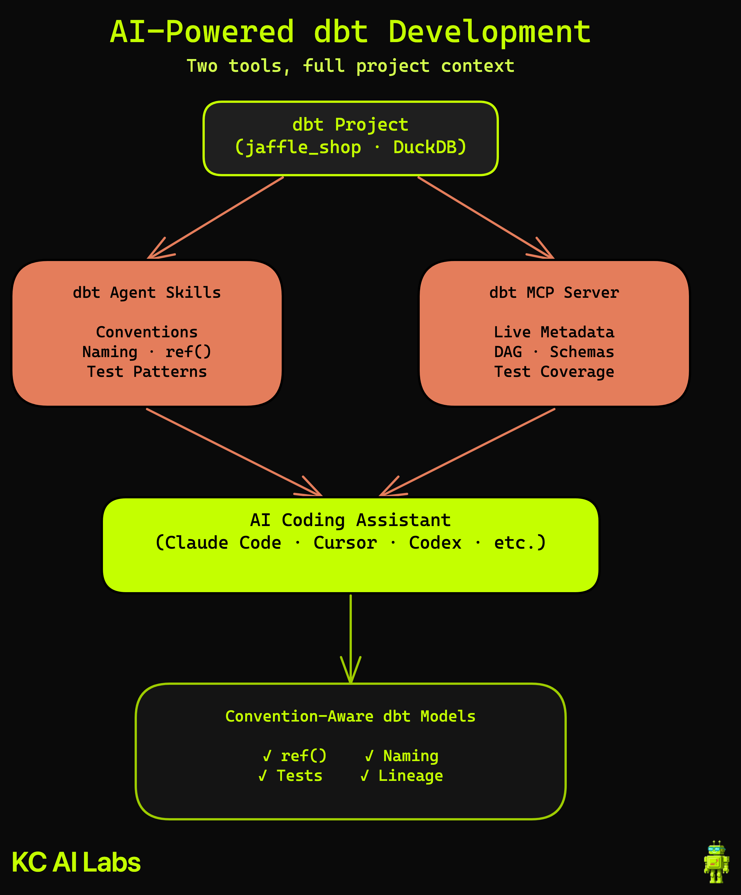

# dbt Agentic Development

**Set up AI-powered dbt development with dbt Agent Skills and dbt MCP Server.**

> Built as part of a [KC Labs AI](https://www.youtube.com/@kclabsai) YouTube video. The video walks through the full setup from installing dbt to building convention-aware, lineage-informed models with Claude Code.

## Architecture



## What This Covers

This repo is the companion to a practical setup tutorial showing how to use AI coding assistants with dbt. You'll go from zero to AI-powered dbt development:

1. Clone the repo (includes jaffle_shop, dbt's canonical demo project)
2. Install dbt with DuckDB (local, free)
3. Add dbt Agent Skills (conventions for your AI assistant)
4. Configure the dbt MCP Server (live project metadata)
5. Build models with Claude Code and see the difference

## Two Tools, One Setup

| Tool | What It Provides | How It Works |
| ---- | ---------------- | ------------ |
| **dbt Agent Skills** | Conventions — naming, ref(), tests, model layers | Installs rules into Claude Code's CLAUDE.md |
| **dbt MCP Server** | Live metadata — DAG lineage, schemas, test coverage | Connects Claude Code to your dbt project at runtime |

Together, your AI coding assistant writes dbt models that follow project conventions and respect existing lineage.

## CLI vs MCP: How They Differ

You might wonder: can't Claude just run `dbt` commands in the terminal? Mostly yes — but the MCP server changes *how results reach Claude*.

| Capability | dbt CLI | dbt MCP Server |
| ---------- | ------- | -------------- |
| Run / test / build | Runs and streams log output | Runs and returns `"OK"` |
| List resources | `dbt ls` → flat FQN strings | `mcp__dbt__list` → same flat FQN strings |
| Compile SQL | `dbt compile` → **prints rendered SQL** (better for inspection) | `mcp__dbt__compile` → returns `"OK"` |
| Preview data | `dbt show` → formatted table (better for humans) | `mcp__dbt__show` → structured JSON (better for Claude) |
| Column schemas + tests | Requires parsing `target/manifest.json` | `get_node_details_dev` → full structured JSON per node |
| DAG lineage | `dbt ls --output json` → flat list, graph must be reconstructed | `get_lineage_dev` → nested parent/child graph |
| dbt docs search | No CLI equivalent | `search_product_docs` |

**The key difference:** CLI output is formatted for humans reading a terminal. MCP returns structured data directly into Claude's context — Claude can traverse a lineage graph, look up column types, or check test coverage without parsing text.

This matters most for context-heavy tasks like auditing test coverage across a DAG. With MCP, Claude gets a nested graph of parents and children as a JSON object. With CLI, it gets a flat list of FQN strings and has to reconstruct the relationships manually — workable, but error-prone at scale.

**When to use each:**

| Reach for the CLI when… | Reach for MCP when… |
| ----------------------- | ------------------- |
| Inspecting compiled SQL — `dbt compile` prints the rendered SQL; MCP just returns `"OK"` | Traversing lineage — `get_lineage_dev` returns a nested graph; CLI returns a flat list |
| Diagnosing failures — CLI streams per-model status, timing, and PASS/WARN/ERROR counts | Looking up column schemas, data types, or test coverage for a specific model |
| Listing resources — output is identical either way, CLI is simpler | Searching dbt docs — `search_product_docs` has no CLI equivalent |

## Prerequisites

| Tool | Version | Purpose |
| ---- | ------- | ------- |
| Python | 3.10+ | dbt runtime |
| Node.js | 18+ | npx for installing skills and MCP server |
| Claude Code | Latest | AI coding assistant |

## Setup

### 1. Clone the repo

```bash
git clone https://github.com/kyle-chalmers/dbt-agentic-development.git
cd dbt-agentic-development
```

### 2. Install dbt and verify the project

```bash
python -m venv .venv
source .venv/bin/activate
pip install -r requirements.txt

dbt run
dbt test
```

### 3. Install dbt Agent Skills

```bash
npx skills add dbt-labs/dbt-agent-skills
```

This adds dbt conventions to your AI coding assistant's configuration. Review the additions in your CLAUDE.md.

### 4. Configure dbt MCP Server

```bash
claude mcp add dbt -e DBT_PROJECT_DIR=$(pwd) -e DBT_PATH=$(which dbt) -- uvx dbt-mcp
```

This connects Claude Code to your dbt project's live metadata (lineage, schemas, tests). The `-e` flags tell the server where your dbt project and binary are — both are required for the CLI and codegen tools to load.

> **Troubleshooting:** If the MCP server only shows docs tools (Search/Get Product Docs), the env vars are missing or incorrect. Verify with `which dbt` and check that you ran the command from the repo root. You can also edit `.mcp.json` directly — see the [AGENTS.md](AGENTS.md) troubleshooting note.

### 5. Try It Out

Ask Claude Code to build a model:

```
Add a staging model that joins raw orders to raw customers so we have
customer info on each order. Include appropriate tests.
```

Then ask for a lineage-aware test audit:

```
Audit the test coverage across the jaffle_shop project. Identify gaps,
but don't re-test pass-through columns that are already tested upstream.
```

The full tutorial prompts are in [`demo/demo_prompt.md`](demo/demo_prompt.md).

## Multi-Tool Compatibility

dbt Agent Skills work with multiple AI coding assistants:

| Tool | Installation |
| ---- | ------------ |
| Claude Code | `npx skills add dbt-labs/dbt-agent-skills` |
| Cursor | `npx skills add dbt-labs/dbt-agent-skills` |
| Windsurf | `npx skills add dbt-labs/dbt-agent-skills` |
| Codex | `npx skills add dbt-labs/dbt-agent-skills` |

The dbt MCP Server is currently Claude Code specific (`claude mcp add`).

## Key Definitions

| Term | Definition |
| ---- | ---------- |
| **dbt Agent Skills** | A package of dbt conventions (naming, ref patterns, testing rules) that installs into your AI coding assistant's context via `npx skills add` |
| **dbt MCP Server** | A Model Context Protocol server that gives Claude Code live access to your dbt project's DAG lineage, column schemas, and test coverage |
| **jaffle_shop** | dbt's canonical demo project — a fake e-commerce dataset with customers, orders, and payments |
| **ref()** | dbt's function for referencing other models — enables automatic lineage tracking |
| **Lineage** | The dependency graph (DAG) showing how models connect — which models feed into which |
| **DuckDB** | An in-process analytical database — runs locally with zero setup, perfect for dbt demos |

## Project Structure

```
dbt-agentic-development/
├── dbt_project.yml           # dbt project config (jaffle_shop)
├── models/                   # dbt models (example/ included)
├── seeds/                    # dbt seed files
├── analyses/                 # dbt analyses
├── macros/                   # dbt macros
├── snapshots/                # dbt snapshots
├── tests/                    # dbt tests
├── .agents/                  # dbt Agent Skills (installed via npx)
├── .claude/skills/           # Skill symlinks → .agents/skills/
├── skills-lock.json          # Skills lock file
├── README.md                 # This file — overview, setup, tutorial prompts
├── CLAUDE.md                 # AI context for Claude Code sessions
├── AGENTS.md                 # Agent instructions (referenced by CLAUDE.md)
├── .env.example              # Environment variable template
├── .gitignore                # Excludes .env, .internal/, dbt artifacts
├── requirements.txt          # dbt-core, dbt-duckdb
├── demo/
│   └── demo_prompt.md        # Tutorial prompts with recording notes
└── images/
    ├── diagram.excalidraw    # Architecture overview (editable)
    └── diagram.png           # Architecture overview (rendered)
```

## Cost

**Free.** Everything runs locally:

- DuckDB — embedded database, no server
- dbt Core — open source
- jaffle_shop — sample data included
- dbt Agent Skills — open source
- dbt MCP Server — open source

No cloud accounts, API keys, or subscriptions required.

## Resources

- [dbt Agent Skills](https://github.com/dbt-labs/dbt-agent-skills) — Convention package for AI coding assistants
- [dbt MCP Server](https://github.com/anthropic-ai/dbt-mcp) — Model Context Protocol server for dbt
- [dbt Core Documentation](https://docs.getdbt.com/) — Official dbt docs
- [jaffle_shop](https://github.com/dbt-labs/jaffle_shop) — dbt's demo project
- [DuckDB](https://duckdb.org/) — In-process analytical database
- [Claude Code](https://docs.anthropic.com/en/docs/claude-code) — Anthropic's CLI for Claude
